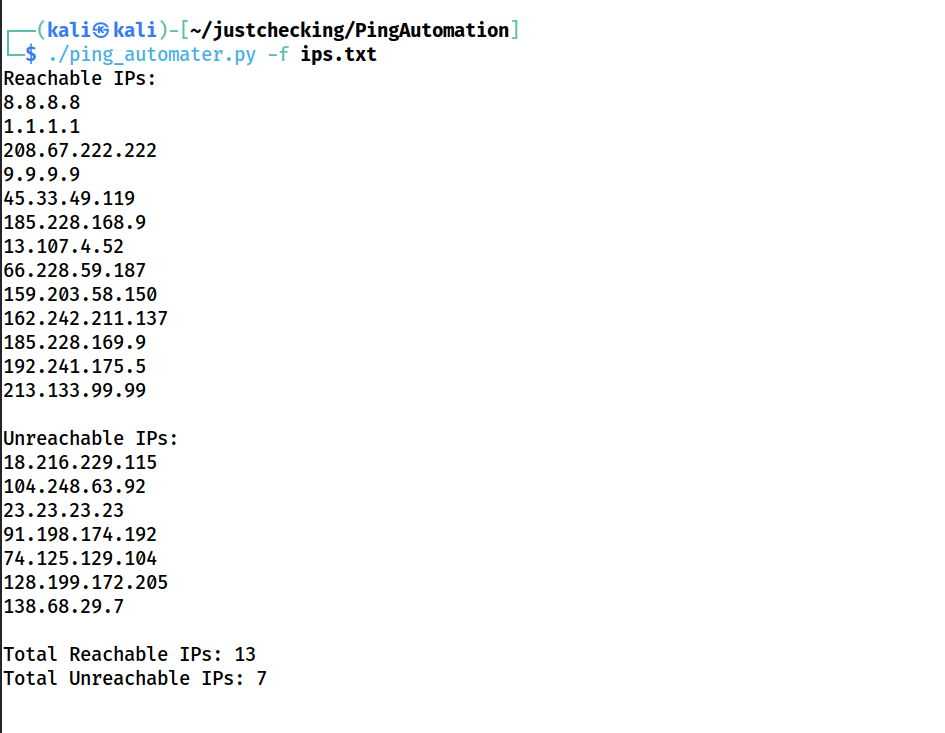

# Ping Automater

## Overview
The Ping Automater is a Python-based tool that allows users to check the reachability of a list of IP addresses specified in a file. It utilizes the `ping` command and distinguishes between reachable and unreachable IPs.

## Features
- **Cross-Platform Compatibility:** Works on both Windows and Linux/Unix systems.
- **IP Reachability:** Determines whether IPs in the specified file are reachable or unreachable.
- **Categorization:** Separates reachable and unreachable IPs for easy reference.

## Usage
### Prerequisites
- Python 3.x
- Ensure the file containing IP addresses is accessible.

### Installation
No specific installation steps are required. Simply download the Python script and ensure the necessary permissions to execute it.

### Command Line Usage
```bash
python ping_automater.py -f <filename>
```
Replace <filename> with the path to the file containing the list of IPs to be pinged.

### Example
```bash
python ping_automater.py -f ip_list.txt
```

### Output
The tool will display a list of reachable IPs and unreachable IPs, along with the total count of each category.


### Contributions
Contributions are welcome! Feel free to fork the repository, make changes, and submit pull requests. For major changes, please open an issue first to discuss your ideas.
